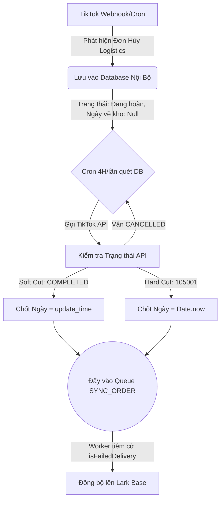

# BÁO CÁO NÂNG CẤP HỆ THỐNG: MÔ-ĐUN KIỂM SOÁT ĐƠN GIAO THẤT BẠI TIKTOK
*(Tài liệu chuyên sâu về Phương án Kiến trúc & Logic Triển khai)*

---

## 1. BỐI CẢNH & ĐIỂM MÙ API (THE BLIND SPOT)
Hệ thống hiện tại gặp phải một "điểm mù" nghiêm trọng liên quan đến luồng **Đơn Giao Hàng Thất Bại** trên nền tảng TikTok:
- Khi kiện hàng thất bại và bắt đầu quá trình quay đầu về kho, TikTok API sẽ chuyển trạng thái (`order_status`) thành `CANCELLED` (Hủy bởi Logistics).
- **Tuy nhiên**, trong suốt nhiều ngày kiện hàng nằm trên đường, trạng thái API bị "đóng băng" ở `CANCELLED` mà không có bất kỳ trạng thái trung gian nào (như `RETURNING`).
- Khi kiện hàng cập bến kho thành công, TikTok âm thầm đổi trạng thái sang `COMPLETED` (Soft Cut) mà không gửi webhook, cũng không cung cấp mốc thời gian rõ ràng (`warehouse_receive_time`).
- **Hệ lụy:** Team Vận Hành/Kho bị mù thông tin, hoàn toàn không biết kiện hàng đang trên đường hay đã về kho.

---

## 2. PHƯƠNG ÁN KIẾN TRÚC TỔNG THỂ (ARCHITECTURE PLAN)

Để xử lý triệt để lỗ hổng này mà không bị phụ thuộc vào bên thứ 3 (như J&T), hệ thống áp dụng pattern **"Polling for Absence & State Diffing"**, tuân thủ 3 nguyên tắc cốt lõi:

### 2.1. Nguyên tắc 1: "Kho lưu trữ riêng, bất biến"
- **Logic:** Khi một đơn hàng bị đánh dấu "Giao hàng thất bại", nó lập tức được lưu vào bảng `normalized_requests` (PostgreSQL) với trạng thái nội bộ là `Đang hoàn` và `warehouseReceivedAt = null`.
- **Đặc điểm:** Bảng Database này lưu trữ vĩnh viễn (không bao giờ tự xóa đơn hàng ngay cả khi TikTok báo lỗi 404, giúp không bị mất dấu). Tuy nhiên, "Danh sách Cần theo dõi" (Watchlist) thực chất chỉ là một bộ lọc logic (`warehouseReceivedAt IS NULL`). Nhờ vậy, khi một kiện hàng đã chốt xong "Ngày về kho", nó tự động rơi ra khỏi Watchlist (không bị quét lại nữa), nhưng record của nó vẫn nguyên vẹn trong DB để phục vụ tra cứu lịch sử.

### 2.2. Nguyên tắc 2: "Quét liên tục vòng lặp khép kín"
- **Logic:** Một Cron Job (Radar) chạy định kỳ 4 tiếng/lần.
- **Tối ưu API:** Thay vì quét toàn bộ lịch sử đơn hàng trên TikTok, Radar **chỉ truy vấn nội bộ** danh sách các đơn đang nằm trong Watchlist (`warehouseReceivedAt IS NULL`), sau đó gọi `getOrderDetail` cho từng đơn để soi trạng thái.

### 2.3. Nguyên tắc 3: "Hội tụ hàng đợi" (Chảy về chung luồng TH-HT)
- **Logic:** Khi Radar bắt được tín hiệu đơn đã hoàn tất, nó kết thúc vòng lặp theo dõi và ném mã đơn vào hàng đợi **BullMQ (`SYNC_ORDER` Queue)**.
- **Mục đích:** Luồng giao thất bại sẽ chảy chung vào một đường ống xử lý với luồng Trả Hàng - Hoàn Tiền (TH-HT). Điều này giúp tái sử dụng logic đồng bộ, chống nghẽn mạng, tự động retry khi lỗi, và không làm treo Cron.

---

## 3. CHI TIẾT LOGIC TRIỂN KHAI CODE (IMPLEMENTATION LOGIC)

Hệ thống đã được bổ sung một Module độc lập (`FailedDeliveryModule`) với các logic xử lý chuyên sâu như sau:

### 3.1. Phân loại và Xử lý Điểm Cắt (Cut-off Logic) trong `failed-delivery.service.ts`

Khi Cron mang mã đơn pending lên tra cứu API TikTok, nó sẽ rơi vào 1 trong 2 kịch bản "Bị cắt API":

*   **Kịch bản A: Soft Cut (Cắt mềm)**
    *   *Dấu hiệu:* API không báo lỗi, vẫn trả về JSON đơn hàng, nhưng `status` đã ngầm chuyển thành `COMPLETED`.
    *   *Xử lý:* Lấy ngay thời gian `update_time` của payload đó làm mốc `Ngày về kho`. Tạo một Job đẩy vào hàng đợi kèm theo cờ `isFailedDelivery: true` và mốc thời gian vừa chốt.

*   **Kịch bản B: Hard Cut (Cắt cứng)**
    *   *Dấu hiệu:* API trả về lỗi HTTP hoặc code `105001` (Order not found).
    *   *Xử lý:* Hệ thống chốt ngay thời điểm phát hiện lỗi (Thời gian hiện tại của Server) làm mốc `Ngày về kho`. Tạo một Job đẩy vào hàng đợi kèm cờ `isHardCut: true` để Worker không cần gọi lại API bị lỗi này nữa.

### 3.2. Tiêm dữ liệu vào Worker chung (`sync-worker.ts`)

Bởi vì TikTok API không cung cấp trường "Ngày về kho", nếu Worker bốc Job ra và tự đi gọi API thì nó sẽ không biết được ngày về kho là ngày nào. Do đó, logic hàng đợi đã được nâng cấp:

1. **Truyền cờ qua Queue Payload:** Khi Cron đẩy Job vào `SYNC_ORDER`, nó truyền kèm các cờ ẩn: `isFailedDelivery` và `warehouseReceivedAtMs`.
2. **Worker Inject:** Khi Worker xử lý Job, nó vẫn gọi API TikTok để lấy dữ liệu tươi nhất. Nhưng ngay trước khi đẩy cho `SyncEngine`, Worker sẽ **tiêm (inject)** cờ `_is_failed_delivery = true` và cờ ngày về kho (`_jt_warehouse_received_at`) vào thẳng object JSON.
3. **Đồng bộ cuối:** `SyncEngine` nhận object đã được "độ" lại, hiểu ngay đây là đơn giao thất bại đã về kho, cập nhật DB chuyển trạng thái thành `Cần kiểm tra` và đồng bộ thành công lên Lark Base.

### 3.3. Tự động hóa lịch trình (`failed-delivery.scheduler.ts`)
- Cron được cài đặt với biểu thức `0 */4 * * *` (Mỗi 4 tiếng).
- Biến trạng thái `isTrackerRunning` được sử dụng làm Lock (Khóa an toàn). Nếu một chu kỳ chạy quá 4 tiếng do nghẽn mạng, chu kỳ sau sẽ tự động bỏ qua để tránh chồng chéo (Race condition) và cạn kiệt tài nguyên.

---

## 4. HƯỚNG DẪN DEPLOY LÊN VPS
Bản nâng cấp hiện tại đã được Code hoàn chỉnh và kiểm thử thành công trên môi trường cục bộ (Local codebase). Để áp dụng bản nâng cấp này lên Production (VPS), thực hiện các bước sau:

1. **Commit Code:** Commit các file mới trong `src/modules/failed-delivery` và các file đã sửa (`app.module.ts`, `sync-worker.ts`).
2. **Pull & Build:** Trên VPS, pull code mới nhất về và chạy `npm run build`.
3. **Restart:** Khởi động lại ứng dụng qua PM2 (`pm2 restart <app_name>`) hoặc Docker (`docker-compose restart`).
4. **Giám sát:** Kiểm tra log của PM2/Docker để đảm bảo `FailedDeliveryScheduler` đã bắt đầu kích hoạt và log ra thông báo `Starting reconcilePendingFailedDeliveries job...`.

*Tài liệu hoàn tất cập nhật vào lúc: 2026-07-11.*
